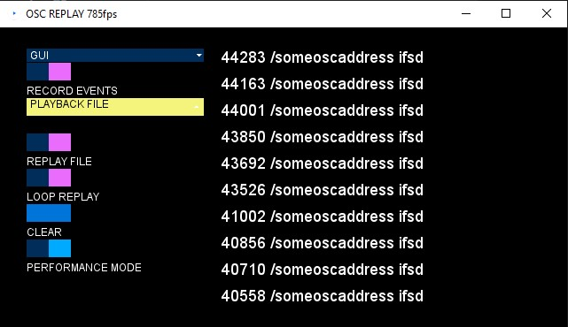

# OSCreplay

## What is this good for?
Ever needed to record OSC events and replay them later? Want to send OSC from the client side vanilla JavaSctipt via WebSockets? Now you can. You can simultaneously record incoming OSC and resend it to another target via proxy. Application is written in [Processing](https://processing.org/), open source user-friendly Java framework.

This application was designed for scientific use, to record experiments, analyze recorded data and repeat the experiment in controlled settings. You do NOT need to know programming to use it. There is a graphical user interface; you can control it with a mouse. If you need to automate the recording's start and end, you can control it by another program with OSC or via WebSockets protocol.  



## Download - OSC replay
* [Latest release](https://github.com/trackme518/OSCreplay/releases/latest)

MacOS and Linux builds will be added later.

Download links provide zipped archive with the tool. You don't need to install anything - just unzip it and run "OSCReplay.exe" file.

## How to use it?
After unzipping simply double click the executable to run the app. You will see a window with GUI. 
 
* RECORD EVENTS - when toggled it will start to record incoming OSC or websockets events and save them into .CSV file in data folder. Make sure to click the toggle again to stop the recording and properly close the file.
* PLAYBACK FILE - dropdown list of avaliable files to replay. All files need to be placed inside "data" folder. Data folder is located inside the downloaded app.
* REPLAY FILE - start playing OSC events saved in .CSV file. You need to select which file to use first.
* LOOP - toggle to loop the replay so it will never stop.
* CLEAR - clear the status messages
* PERFORMANCE MODE - disable rendering GUI to speed up the program.

Displayed status messages are for debug - yellow ones are outgoing messages from replay. Green messages are incoming messages. Address pattern and typetag are printed. You can see last 10 messages. In performance mode no messages are being displayed to increase performance. 

## Setting OSC/Websocket IP, ports & more
Beside GUI there are more settings. Go into the data folder inside the OSCReplay App. Open "settings.json" in notepad.
```JSON
{
  "proxyEnabled": true,
  "oscListenPort": 12000,
  "targetOscIp": "127.0.0.1",
  "useWebsocket": true,
  "myOscIp": "127.0.0.1",
  "websocketPrefix": "/oscutil",
  "websocketPort": 9999,
  "oscTargetPort": 16000,
  "maxFrameRate": 1000
}
```
* "proxyEnabled": Boolean - whether the incoming OSC messages should be resend to "targetOscIp" and "oscTargetPort", effectively acting as a proxy. This way you can record and relay the messages at the same time. 
* "oscListenPort": Integer - port where the App is listening for OSC commands (to control GUI remotely)
* "targetOscIp": String - IP where to send OSC commands
* "useWebsocket": Boolean - whether to use Websocket proxy
* "websocketPort": Integer - Websocket port - please note that firewall or your web browser might allow only certain ranges of ports, also some Apps such as TeamViewer might be already using some ports
* "oscTargetPort": Integer - where to send OSC commands, note that some apps might be already using some ports
* "maxFrameRate": Integer - set max framerate at which the App will try to run - 120 should be enough. This will influence performance and your PC reasources.

## OSC
ReplayOSC App supports only single messages (bundles are interpreted as single messages) and Integer, Float, String, Double variable types. App supports multiple variables in a single message. 

## Timestamps
Timestamps are issued in recorder - it represents recieved time since the recording started. If you need to measure the sender's time, I suggest you add extra parameter to your OSC message that will represent time send in millis. OSC does not natively supports synchronized clock between server and client and bundles' timetag is only releative to reciever absolute time.  See the [specification](https://opensoundcontrol.stanford.edu/spec-1_0.html) for more. You can also use "timetag" parameter of OSC bundle to set timestamp - this should be in NTP format according to standart. I am converting to more convenient UNIX format, when recording to .csv file. 

## .CSV file format
OSC/Websocket events are saved in .CSV file in data folder inside OSCreplay App. I am using buffered writer and reader so the file is written or red one line at a time. This is important to avoid out of memory error when reading / writing large files. CSV files uses ',' comma delimeter. First collumn is "timestamp" in milliseconds (Integer). First event is always timestamped as 0 - time before the first event arrive is ignored. Second collumn is "OSCaddress" - it should always start with "/" to comply with OSC protocol. Third collumn is "typetag". Typetag is used to determine how many variables are in the message data - each character represents one variable. Order matters. You can also have empty typetag in case there are no data in the message. Subsequent collumns are individual variables - number of variables must correspond to length of the typetag. 

| timestamp | OSCaddress | typetag | timetag | var1 | var2 | var3 | var4 |
| --------- | ---------- | ------- | ---- |----- |----- |----- |----- |
|0 | /someaddress | ifsd | 1 | 16 | 16.666 | some text | 16.666 |

## How does it work?
Under the hood the tool is programmed in Processing Java to run GUI and OSC and Websocket server. 

## How to build from source?
Download [Processing](https://processing.org/) (originally made with version 4.2), download libraries [OSCP5](https://github.com/sojamo/oscp5), [websockets](https://github.com/alexandrainst/processing_websockets), [controlP5](https://github.com/sojamo/controlp5). Open the source and select File->Export Application to build for your platform. Processing supports Windows, Linux, Apple, Android, functionality depands on your hardware and some changes might be needed. Read more at [Processing documentation](https://processing.org/environment/#export).  

## Websocket
You can send vanilla websocket messages to the app and it will proxy them as proper OSC messages to the target. You can also save them into .CSV file and send them as OSC later. Websocket messages need to be encoded in JSON format and send as plain String like so:

```JSON
{
  "address": "/sometarget",
  "data": [
    {
      "type": "d",
      "value": 16
    },
    {
      "type": "f",
      "value": 16
    },
    {
      "type": "s",
      "value": "sometext"
    },
    {
      "type": "i",
      "value": 16
    }
  ]
}
```
In HTML + JavaScript:
```HTML
<html>
<body>
<button onclick="sendMessage()">Send Message</button>

<script>
var ws = null;

function connectWebsocket() {
	if ("WebSocket" in window) {
		ws = new WebSocket("ws://127.0.0.1:9999/oscutil");
		ws.onopen = function () {
			console.log("Connection opened");
		};
		
		ws.onmessage = function (event) {
		    console.log("Message received: " + event.data);
		};
		
		ws.onclose = function () {
			console.log("Connection closed");
		};
	}
}

connectWebsocket(); //establish connection to OScreplay App

function sendMessage() {
  //Prepare Websocket message
  var obj = { "address":"/someoscaddress", "data":[] };
  obj['data'].push({"type":"i","value":16});
  obj['data'].push({"type":"f","value":16.333});
  obj['data'].push({"type":"s","value":"some text"});
  obj['data'].push({"type":"d","value":16.333});
  var myJSON = JSON.stringify(obj);
  if(ws == null){
  	console.log("Webscoket connection not established");
  }else{
  	ws.send(myJSON); //send via websocket
  }
}
</script>

</body>
</html>
```

Permissible types:
* i Integer
* f Float
* s String
* d Double

### Control OSCReplay remotely without GUI
You can also control the OSCReplay App with OSC or Websockets messages. Below see the list of "address pattern" - permissible value and type - description.
* "/oscutil_recording" - Integer 0 or 1 - trigger or end recording incoming messages into .CSV file.
* "/oscutil_play" - Integer 0 or 1 - start or stop replay from .CSV file (select the file to play first)
* "/oscutil_loop" - Integer 0 or 1 - set the replay to loop or play once
* "/oscutil_performance" - Integer 0 or 1 - enter or end performance mode
* "/oscutil_file" - Integer 0 to Infinity - select index of the file for replay
* "/oscutil_listfiles" - no values - This will return names of avaliable replay files as String with ';' delimeter
* "/oscutil_countfiles" - no values - This will return Integer with count of avaliable .CSV replay files.

### Windows
Tested on Windows 10. It should work out of the box. Just double click the "OSCReplay.exe" file. If you are using antivirus such as Windows Defender it will show warning - you can safely click "More info" and choose "Run anyway". Next time it should run without warning. Allow the program in your firewall for both private and public connections.

## Known bugs
If you are using websockets you need to close the connection from the client properly on exit otherwise there will websocket timeout error in the OSCReplay App and you will need to restart it.

## License
Creative Commons Attribution-NonCommercial-ShareAlike 4.0 International (CC BY-NC-SA 4.0). When using or distributing the code, give a credit in the form of "OSCreplay software (https://github.com/trackme518/OSCreplay) by Vojtech Leischner (https://tricktheear.eu)". Please refer to the [license](./LICENSE.markdown) or see online [reference](https://creativecommons.org/licenses/by-nc-sa/4.0/). Author is not liable for any damage caused by the software. Usage of the software is completely at your own risk. For commercial licensing please [contact](https://tricktheear.eu/contact/) us.   
